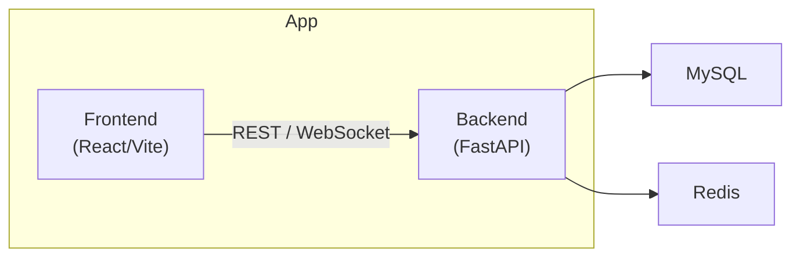
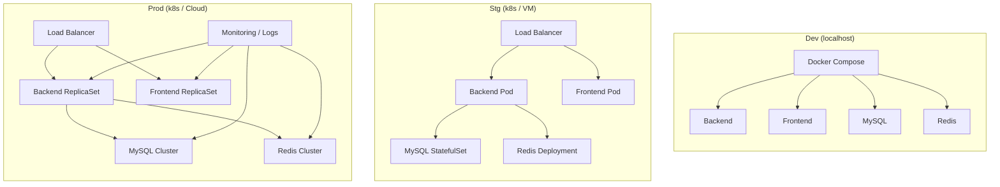

# Arquitetura de Ambientes

Este documento descreve a arquitetura dos três ambientes do projeto WeBot-ChatFLOW: **development**, **staging** e **production**. Aqui estão os objetivos e componentes principais de cada um, além de diagramas e exemplos de configuração.

---

## 1. Objetivos por ambiente

| Ambiente     | Objetivo principal                                        | Perfis de segurança e compliance           |
|--------------|-----------------------------------------------------------|--------------------------------------------|
| development  | Rápida iteração local, debug e testes unitários           | Acesso aberto (localhost), sem dados reais |
| staging      | Testes de integração com dados próximos da produção       | Acesso restrito (VPN ou IP allowlist)      |
| production   | Serviço em escala, alta disponibilidade e monitoramento   | TLS obrigatório, WAF, backups diários      |

---

## 2. Componentes e recursos

| Componente      | Imagem base                  | Recursos mínimos (CPU/RAM) | Variáveis de ambiente críticas            |
|-----------------|------------------------------|----------------------------|-------------------------------------------|
| **backend**     | `python:3.11-slim`           | 0.5 vCPU / 512 MiB         | `DATABASE_URL`, `REDIS_URL`, `SECRET_KEY` |
| **frontend**    | `node:18-alpine`             | 0.2 vCPU / 256 MiB         | `API_BASE_URL`                            |
| **MySQL**       | `mysql:8.0`                  | 0.5 vCPU / 512 MiB         | `MYSQL_ROOT_PASSWORD`, `MYSQL_DATABASE`   |
| **Redis**       | `redis:7-alpine`             | 0.2 vCPU / 256 MiB         | —                                         |
| **(opcional)**  | RabbitMQ, MinIO, …           | conforme uso               | conforme serviço                          |

---

## 3. Diagrama de Componentes

---

## 4. Diagrama de Deployment

